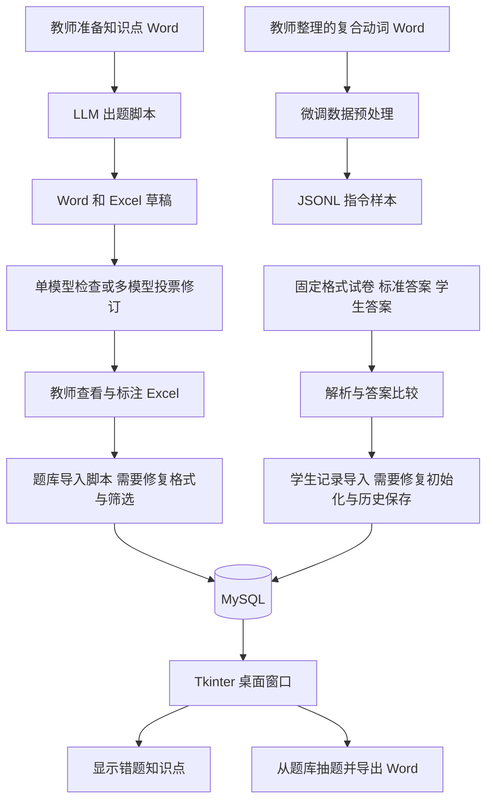

# JAP_LLM_Platform

借助大语言模型和教学任务执行框架，逐步构建 AI 辅助日语教学平台。

本项目面向日语教师和学生，希望把作业批改、知识点诊断、针对性练习和长期学习记录连起来。大语言模型负责生成与检查语言内容，项目自己的 **harness** 负责组织任务、约束题目格式、调用模型、检查和修订结果、保存材料，并连接题库与学生记录。这里的 harness 是这些协同工作的程序流程，并不是另一个需要下载的模型。

**目前仓库是一套教学研究原型，包含桌面界面、MySQL 数据处理、LLM 出题与修题实验，以及微调数据预处理。它尚未成为上传作业后即可自动完成全部流程的在线教学平台。**

本文及各目录说明按代码快照 `f4bd5b4` 编写，核对日期为 2026-09-22。已有样例文件说明对应工作曾留下产物，不代表本次交接已经完成运行验收、教学效果评估或线上部署。

## 1. 第一次阅读的入口

| 你的角色 | 建议阅读顺序 | 阅读后能了解的内容 |
| --- | --- | --- |
| 教师或项目负责人 | 本页 → [材料目录](docs/README.md) → [后续计划](docs/ROADMAP.md) | 项目目标、目前进展、题目和反馈材料的位置、下一步工作 |
| 不写代码但需要试用的同事 | 本页 → [安装与运行](docs/SETUP.md) → [界面说明](Source%20Code/Front_End/README.md) | 需要安装什么、技术同事需要先准备什么、界面按钮做什么 |
| 接手开发的同事 | [代码总览](Source%20Code/README.md) → 各模块 README → [已知问题](docs/KNOWN_ISSUES.md) | 文件分工、调用关系、输入输出、阻碍完整运行的问题 |
| 继续出题与质量研究的同事 | [出题模块](Source%20Code/Paper_Generator/README.md) → [教师反馈](docs/paper_with_feedback/README.md) | 生成、单模型修订、多模型投票、人工评价和比较流程 |

## 2. 项目希望解决的教学问题

### 从批改走向有依据的个性化练习

教师上传学生的作业或试卷后，平台应保存题目、标准答案和学生答案，逐题判断对错，并把错误关联到词汇、语法或具体用法。模型再结合题目内容、学生所选答案和历史表现，提出学生可能尚未掌握的知识点，以及出现错误的可能原因。原因分析应保留证据和不确定性，由教师复核，不能仅凭一道错题断定学生能力。

例如，学生多次混淆「たら」和「ば」时，平台应能整理相关作答记录，给出适合该学生的简明讲解，并从已审核题库抽取练习；题库不足时，再由 LLM 生成新题，经过程序检查、模型复核和教师审核后使用。这里的例子描述目标工作流，不表示当前界面已经实现整条流程。

### 把数据库作为教学记忆

数据库计划同时保存三类内容。

1. 学生的历次作业、试卷、答案、错题与复习结果，用于持续跟踪，而不只保留最近一次成绩。
2. 与知识点对应的题目、标准答案、解释、难度和审核状态，用于复用高质量题目，减少重复调用模型。
3. 教师的修改意见、题目来源和模型版本，用于解释题目为何被采用、分析共性困难和评估教学质量。

在这个设计里，数据库提供可查询的长期记录。保存数据库记录并不等于训练模型，也不代表 LLM 会自动记住学生。程序仍须检索相关记录，并明确决定哪些内容进入分析或出题流程。

### LLM、harness 和教师各自负责的工作

| 组成 | 通俗理解 | 本项目中的职责 |
| --- | --- | --- |
| LLM | 能处理和生成语言的助手 | 根据知识点生成题目，提出错误检查和修订意见 |
| Harness | 安排工作和检查结果的流程 | 读文件、组织提示词、调用 API、解析题号和选项、重复检查、保存结果、连接数据库 |
| 数据库 | 可查询的教学档案柜 | 存放题目、学生和作答记录，为抽题和分析提供数据 |
| 前端 | 使用者看到的窗口 | 接收操作，显示数据库查询和分析结果，导出练习 |
| 教师 | 教学质量的最终判断者 | 审核语言自然度、答案唯一性、知识点匹配和难度，并决定是否使用 |

当前 LLM 程序主要通过 DashScope 的兼容接口调用 Qwen 系列模型。大模型运行在服务提供方，当前 API 路线不要求使用者在自己的电脑上下载模型或准备 GPU。

## 3. 现在做到哪里

| 能力 | 当前代码或材料 | 实际边界 |
| --- | --- | --- |
| 读取作业与答案 | `jap_paper_revise.py` 和 Word 样例 | 按固定 Word 格式、题号和答案标记解析；没有通用 PDF、照片或手写 OCR 上传流程 |
| 判断选择题对错 | 标准答案与学生答案逐项比较 | 基于答案匹配；不是用 LLM 批改任意开放式回答 |
| 关联知识点 | 从试卷的 `-Knowledge Points:` 标记提取 | 依赖已有标注；还没有完整的自动知识点识别与学生错误原因诊断 |
| 题库与学生记录 | `questions`、`students`、`exam_results` 三张表的原型 | 有建表、导入和查询代码；仍存在破坏性初始化、字段语义冲突和历史记录被删除的问题 |
| 桌面界面 | Tkinter 的 `interface.py` | 可按姓名或学号查询，显示错题相关知识点，按数据库题目生成 Word；不是网页应用 |
| 针对性抽题 | `test_paper_generation.py` | 按错题知识点分配题量并随机查询题库；`Generate` 不会直接调用 LLM 现场出新题 |
| LLM 出题与修订 | 多个 `jap_question_generator_*` 实验脚本 | 根据知识点生成，检查多解、题干和重复等问题，保存 Word 或 Excel；与 GUI 尚未统一接通 |
| 多模型复核 | 两套 voting 模块 | 加权投票决定是否修订；模型共识不能替代教师审核 |
| 教师反馈与比较 | Excel 反馈、题号索引和比较脚本 | 有原题、教师标注、模型修订样例；比较中的 `Correct Rate` 是修改决策与人工标注的一致率，并非题目正确率 |
| 微调准备 | `data_preprocessor.py` 与 84 条 JSONL 样本 | 已有词条到指令数据的转换；没有训练脚本、模型权重或训练效果报告 |

原始定位围绕 JLPT N4/N5，后续材料也包含复合动词和条件表达。文件夹名称、模型提示词中的级别以及已有样例，都不能单独证明题目已经通过该级别的教学审核。

## 4. 当前组件的关系

下面画的是现有代码关系。数据库导入环节仍需修复和人工配置，箭头不表示已经通过端到端验收。



未来要进一步连接上传、自动知识点识别、错误原因解释、教师审核、长期学习画像和复习调度，见[路线图](docs/ROADMAP.md)。

## 5. 仓库结构

```text
JAP_LLM_Platform/
├── README.md                       项目总说明和阅读入口
├── requirements.txt                Python 依赖及固定版本
├── .gitignore                      默认不提交的临时文件和生成结果
├── .gitattributes                  统一文本文件换行方式
├── Source Code/
│   ├── README.md                   代码地图
│   ├── Front_End/                  Python 桌面窗口
│   ├── Paper_Generator/            出题、修题、试卷解析、抽题与比较
│   ├── SQL_Database/               MySQL 建表、数据导入和查询原型
│   └── Fine_Tuning_Module/         Word 词条转微调数据
└── docs/
    ├── README.md                   材料索引
    ├── SETUP.md                    安装、配置和运行步骤
    ├── KNOWN_ISSUES.md             从源码核对的限制与运行阻碍
    ├── ROADMAP.md                  后续开发阶段与验收标准
    ├── Generated_paper/            生成题、修订输入和入库归档样例
    ├── paper_with_feedback/        教师反馈、问题题号和词条资料
    ├── revised_shatin/             按模型存放的修订结果与日志
    ├── student_test_sample/        学生答卷格式样例
    └── processed test paper/       清理后的试卷中间文件
```

每个已有目录都附有 README。代码目录逐个解释 Python 文件，材料目录逐个列出当前文件及其用途。`.py` 是程序，`.docx` 是 Word 文档，`.xlsx` 是 Excel 工作簿，`.jsonl` 是一行一个数据样本的文本，`.md` 是 GitHub 可直接显示的说明文档。

## 6. 安装与试用概览

**只阅读本项目和已有题目，不需要运行 Python 或安装数据库。** 在 GitHub 阅读说明，下载 Word 或 Excel 文件即可查看材料。

需要运行时，先阅读[安装指南](docs/SETUP.md)。技术同事应先准备 Python 环境，并根据任务选择配置 LLM API 或 MySQL。

| 使用任务 | 需要的环境 | 不需要的组件 |
| --- | --- | --- |
| 查看已有试卷与教师反馈 | Word、Excel 或兼容阅读软件 | Python、MySQL、模型 API |
| LLM 出题和修题 | Python 依赖、网络、可用的 DashScope API 凭据 | MySQL 服务、GPU |
| 运行桌面窗口 | Python、Tkinter、可连接且已有数据的 MySQL | Node.js、npm、网页服务器 |
| 查看数据库 | 运行中的 MySQL 服务，加一个客户端 | DataGrip 不是强制要求，可用 MySQL 命令行或其他客户端 |
| 准备微调样本 | Python 和 `python-docx`、源 Word 文件 | 当前转换脚本不需要 GPU、MySQL 或模型 API |

数据库必须实际运行在某台电脑或服务器上。`SQL_Database/` 是操作数据库的代码，不是一个已经部署好的数据库。DataGrip 是连接和查看数据库的工具，安装 DataGrip 不会自动启动 MySQL，也不会自动导入本项目的数据。

**不要把运行 `insert_db.py` 或 `db_question_students_results.py` 当成无风险的初始化步骤。当前代码在导入建表模块时会删除旧表。** 具体准备方式和修复顺序见[数据库说明](Source%20Code/SQL_Database/README.md)。

## 7. 后续优先工作

1. 先统一数据库配置和对错字段，移除导入时删表行为，保证学生多次作业记录可以保留。
2. 用一套匿名样例打通读取、批改、审核入库、查询和针对性抽题，并记录可重复的验收步骤。
3. 增加题目审核状态、来源、知识点编号和解释，让教师能追踪并复用可信题目。
4. 将 LLM 诊断和出题能力接入统一任务流程，提供上传、进度、失败提示和教师确认。
5. 在可靠数据与评价基础上发展学习画像、间隔复习、教师统计面板，以及检索增强或微调实验。

这些是建议的开发方向，不是已承诺的交付时间表。每阶段的产物和验收标准见[路线图](docs/ROADMAP.md)。

## 8. 交接与版本管理

当前仓库为 [CUHKJASGRF20262027/JAP_LLM_Platform](https://github.com/CUHKJASGRF20262027/JAP_LLM_Platform)。已有本地副本可在该副本目录执行以下命令更新远端地址。

```sh
git remote set-url origin https://github.com/CUHKJASGRF20262027/JAP_LLM_Platform.git
git remote -v
git fetch origin
```

转移后仓库出现在新所有者名下，本地文件夹不会因为转移自动消失。GitHub 账户的仓库权限、本机 Git 登录状态和第三方集成的授权范围需要分别检查。[GitHub 官方转移说明](https://docs.github.com/en/repositories/creating-and-managing-repositories/transferring-a-repository)介绍了原所有者作为 collaborator 保留访问以及旧地址重定向的行为。

交接时还需要移交数据库地址与备份、API 账户的管理方式、经过审核的题库和可复现的环境信息。凭据应通过团队认可的私密渠道交接，不应写入 README。仓库里的现有学生样例在进一步分享或演示前，应确认授权并使用匿名副本。

## 9. 许可状态

当前代码快照没有 `LICENSE` 文件，因此本说明不宣称项目已采用 MIT 或其他开源许可证。代码和教学材料的使用、再分发范围需由项目负责人明确，第三方材料也需保留相应来源和授权信息。
